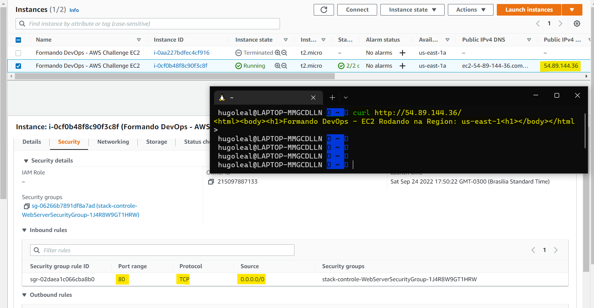
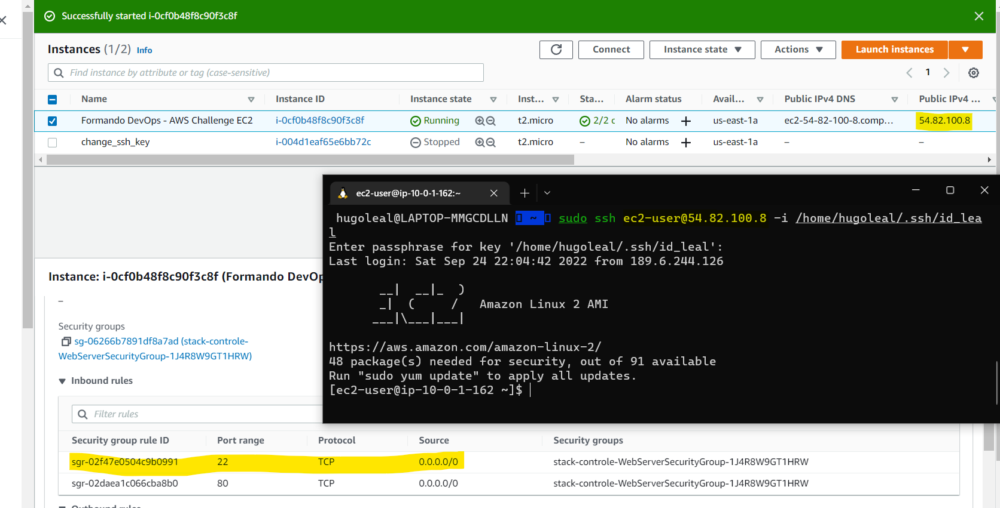
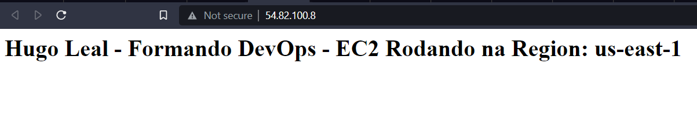
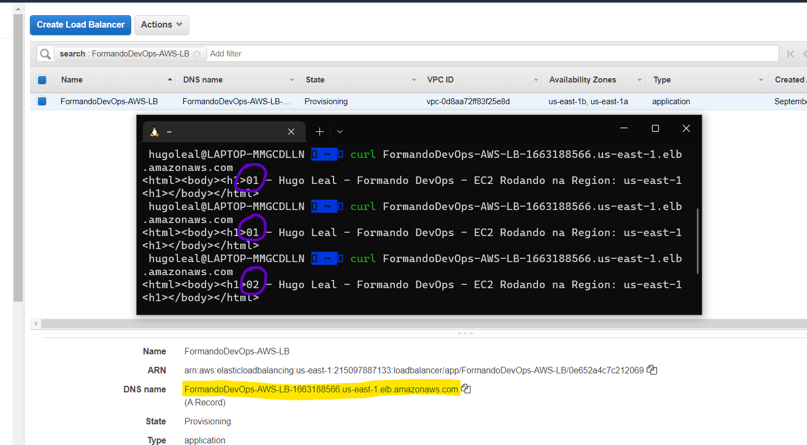
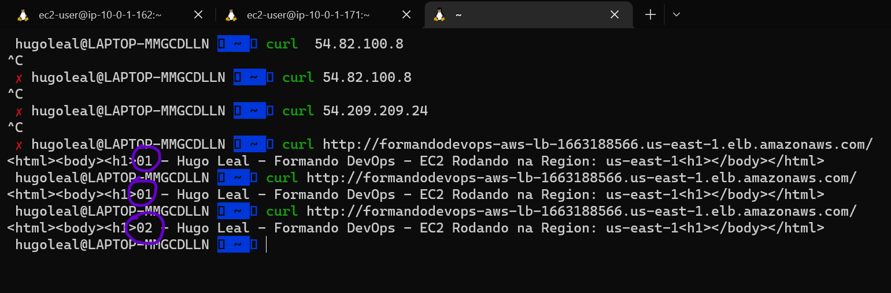

# Desafio 2: AWS

> Proposta de resolução para o Desafio 2 do programa Formando DevOps - GetUp
Autor: Hugo Leal
Data: 27SET22
> 

## Tarefa 1: Setup de ambiente

O ambiente foi criado com sucesso utilizando o arquivo "formandodevops-desafio-aws.json”.

## Tarefa 2: Networking

Inicialmente a Instância EC2 não estava respondendo na porta 80 devido a uma Inbound Rule no Security Group à ela atrelado. Bastou editar a Rule para permitir entrada TCP na porta 80 de qualquer origem, conforme imagem abaixo.

## Tarefa 3: EC2 Access

### Tarefa 3.1: Acessando a EC2 via SSH

Como não havia nenhuma chave cadastrada na instância, foi realizado o seguinte procedimento:

- Detach no volume EBS da instância;
- Criação de uma nova instância EC2 com uma chave conhecida;
- Attach do volume na nova instância;
- Inserção da chave publica no diretório `/home/ec2-user/.ssh/authorized_keys` (relativo ao volume montado)
- Desligamento da máquina nova, e attach do volume modificado à EC2 original

Em seguida, foi necessário inserir no Security Group uma Inbound Rule para permitir o acesso SSH na instância EC2.

### Tarefa 3.2: Alterando o texto da pág web

Após edição do arquivo `/var/www/html/index.html` para adicionar meu nome, foi realizado um teste e não funcionou. Em análise, foi verificado que o serviço `httpd` não havia startado com a máquina. Bastou iniciar o serviço com o comando `systemctl start httpd`.

## Tarefa 4: EC2 troubleshooting

Para o serviço `httpd` iniciar na inicialização da máquina, bastou dar enable através do comando abaixo:

`systemctl enable httpd`

## Tarefa 5: Balanceamento

A instância foi clonada através da opção `Launch more like this`.

O texto no arquivo `/var/www/html/index.html` foi editado com o início 01 ou 02 para identificar as máquinas.

Em seguida, foi criado um target group com as 2 instâncias EC2 em execução.

Por fim, foi criado um Load Balancer utilizando o target group recém-criado na porta 80.

## Tarefa 6: Segurança

No Security Group atrelado às EC2, foi modificado a Inbound Rule para aceitar apenas conexões na porta 80 vindas do Security Group utilizado no Load Balancer.

Após aplicadas as configurações, os IP’s publicos das EC2’s pararam de responder e apenas o Load Balancer respondia pelas 2 EC2.

