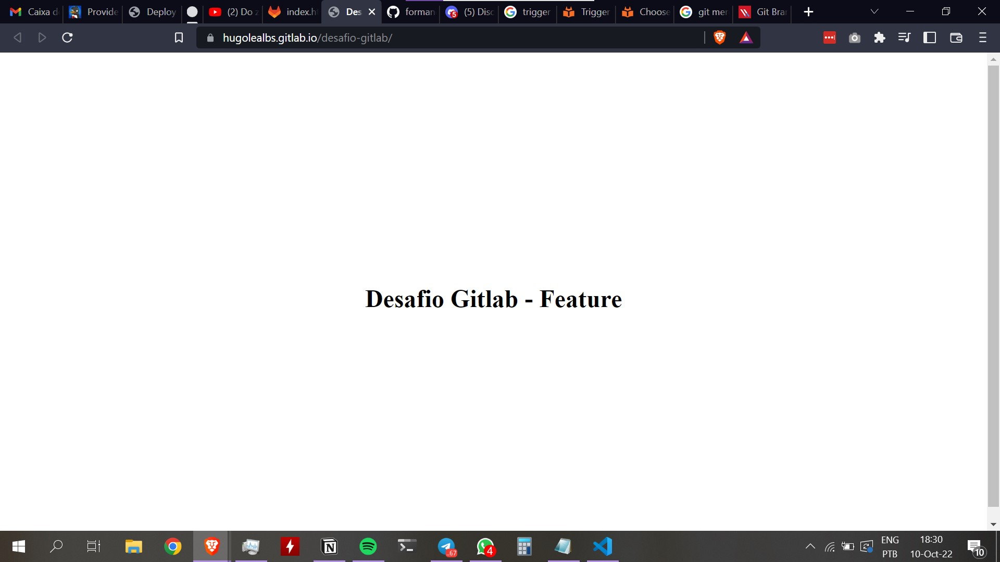
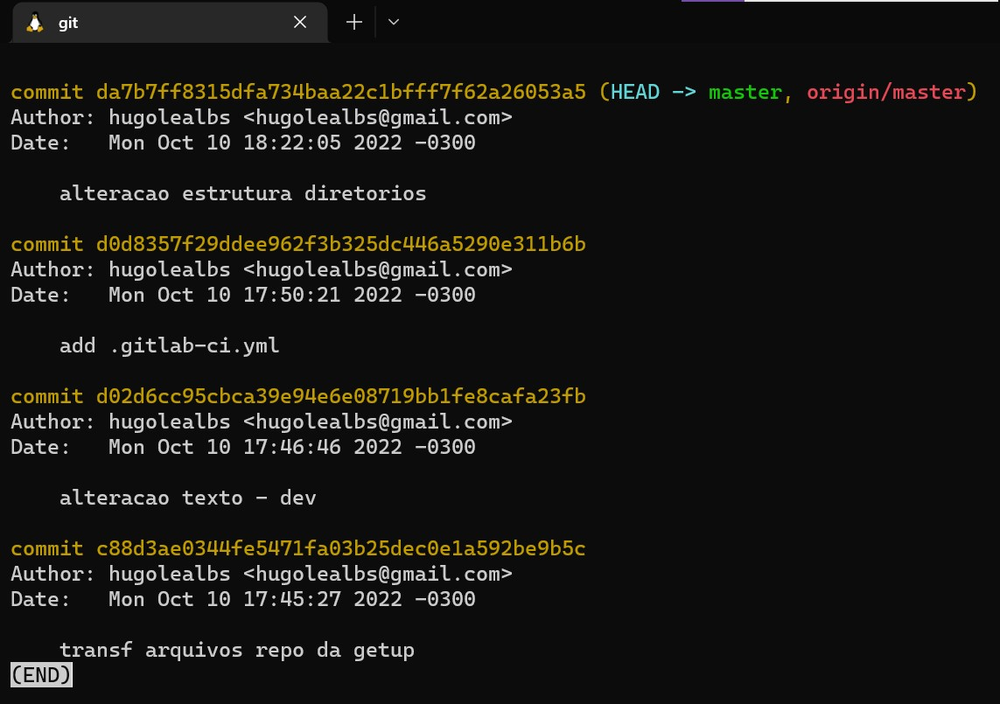

# Desafio 4: GITLAB

> Proposta de resolução para o Desafio 4 do programa Formando DevOps - GetUp
> 

## Links:

- Repositório do GitLab: https://gitlab.com/hugolealbs/desafio-gitlab
- Gitlab Page: https://hugolealbs.gitlab.io/desafio-gitlab/

## Prints:

Texto "DEV" em funcionamento no branch main:

Texto "FEATURE" após merge dos branches:

Obs: o merge foi realizado no próprio repositório web.

Resultado do comando git log na branch master:

