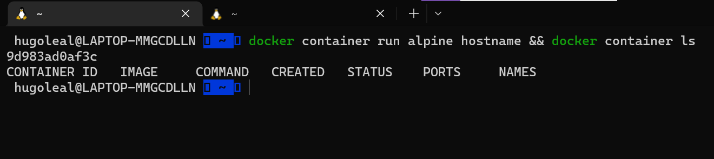

# Desafio 5: DOCKER

> Proposta de resolução para o Desafio 5 (Docker) do programa Formando DevOps - GetUp
> 

## Respostas
Segue abaixo os prints/comandos com as respostas para os exercícios:

1 



2


3


4


5


6

```bash
docker system prune
```

7

```bash
docker history <nome da imagem>
outras informacoes podem também ser vistar com o:
docker image 
```

