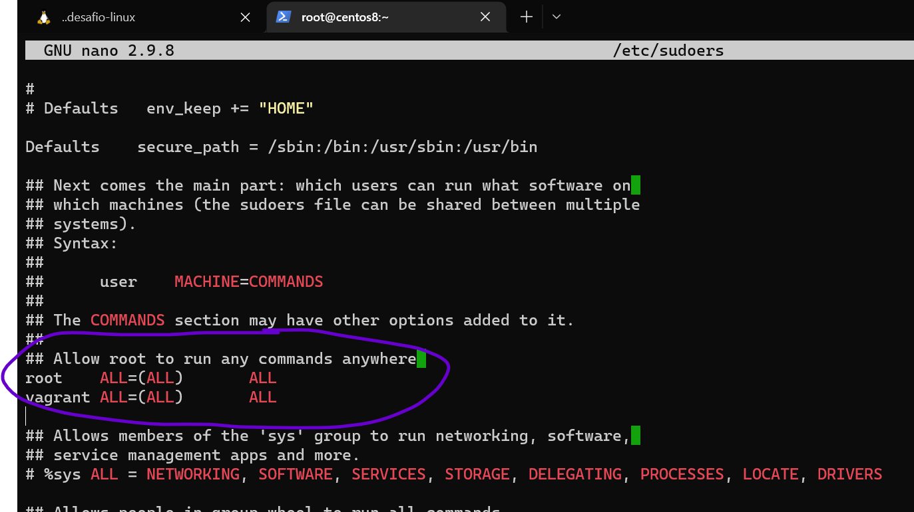

# Desafio 1

---

> Proposta de resolução para o Desafio 1 do programa Formando DevOps - GetUp

## Tarefa 1: Kernel e Boot Loader

---

**O que foi realizado:** 

- Boot no modo recovery
- Remount da partição / como **rw**
- Alteração da senha do root para uma senha conhecida.

De posse da senha de **root** da máquina, foi editado o arquivo `/etc/sudoers` para reativar a permissão no **sudo** para o usuário **vagrant.**



## Tarefa 2: Usuários

---

**O que foi feito:**

```bash
## Criacao do grupo getup com gid 2222
groupadd -g 2222 getup

## Criacao do usuario getup com uid 1111 e grupos getup e bin
useradd -u 1111 -g getup -G bin getup
```

Alteração no arquivo `/etc/sudoers` para o usuário `getup` executar comandos sem necessidade de senha:


## Tarefa 3: SSH

---

### Tarefa 3.1: Autenticação confiável

Para desativar o login por senha, foi alterado o arquivo `/etc/ssh/sshd_config` conforme print abaixo:


### Tarefa 3.2: Criação chaves

Através do comando `ssh-keygen` foi gerada a chave para o usuário vagrant.


A chave publica foi adicionada no `/authorized_keys` do usuario vagrant, e seu acesso através do protocolo SSH utilizando a chave é demonstrado abaixo:


### Tarefa 3.3: Análise de logs e config SSH

**O que foi feito no host local:**

```bash
## Decodificacao e descompressao da chave 

base64 -d id_rsa-desafio-linux-devel.gz.b64 | zcat > id_decoded

## Conversao para ser utilizada em sistemas UNIX

cat id_decoded | dos2unix > id_decoded_unix
```

Após tentativa de utilizar a chave convertida, ainda não é possível logar na VM. Olhando os logs de autenticação, nota-se que o /authorized_keys está em no formato DOS também.

```bash
cat /home/devel/.ssh/authorized_keys | dos2unix > /home/devel/.ssh/authorized_keys
```

Após a execução do comando acima, o Login via SSH funcionou com sucesso:


## Tarefa 4: Systemd

---

**O que foi feito:**

- Adição de `;` no arquivo `/etc/nginx/nginx` para corrigir a sintaxe
- Modificação no arquivo `/usr/lib/systemd/system/nginx.service` consertando o parâmetro que estava quebrando atrapalhando seu start
- Foi notado que o serviço estava escutando na porta 90. Dessa forma, sem especificar a porta e colocando http antes ele vai na porta default (80) e nao acha nada. Alterando o comando para utilizar a porta 90, é obtida a resposta


Para dar certo da forma pedida, isto é, sem alterar o comando, basta alterar a porta de listen no arquivo de conf do nginx. 


## Tarefa 5: SSL

---

**O que foi feito:**

- Criação de uma key e certificado CA
- Criação de uma key para o nginx e CSR
- Assinatura do certificado para o nginx através do CA
- Edição no arquivo de conf. do nginx para escutar na porta 443 e apontar os arquivos key e certificado gerados

[https://www.golinuxcloud.com/create-certificate-authority-root-ca-linux/](https://www.golinuxcloud.com/create-certificate-authority-root-ca-linux/)

Segue abaixo resultado do comando solicitado, e confirmação que o nginx está utilizando as chaves geradas.


Obs: foi necessário apontar através da flag `--cacert` para o comando `curl` utilizar o CA criado.

## Tarefa 6: Rede

---

### Tarefa 6.1: Firewall

O comando `ping` funcionou sem demais ajustes:


### Tarefa 6.2: HTTP

Resposta com headers obtida através do comando `curl` com flag `-i` :


### Tarefa 6.3: Logs

Foi criado o arquivo `/etc/logrotate.d/nginx` com o conteúdo abaixo:


## Tarefa 7: Filesystem

---

### Tarefa 7.1: Expandir partição LVM

```bash
# Procedimento realizado descrito abaixo
# 1. Desmontar o LV data_lv, pois seu espaço é proveniente do /dev/sdb1
umount /data

# 2. Aumento da partição fisica /dev/sdb1, sem alterar a assinatura do LVM
fdisk /dev/sdb1
# Comandos interativos fdisk...

# Fazendo reconhecimento do tamanho do novo PV
pvresize

# O Volume reconhece sozinho
# Aumentando o LV com o novo tamanho do /dev/sdb1

lvresize /dev/data_vg/data_lv /dev/sdb1

# Checando a particao recém-aumentada e increase do filesystem
e2fsck -f /dev/mapper/dava_vg-data_lv
resize2fs /dev/mapper/data_vg-data_lv
```

Segue abaixo resultado das camadas do LVM e df -h:


### Tarefa 7.2: Criar partição LVM

O que foi feito:

- Através do comando fdisk, criação de uma nova partição /dev/sdb2 com tamanho 5G e tipo Linux LVM
- Formatação da partição através do `mkfs.ext4`


Obs: O que foi solicitado a fazer é formatar com ext4 a partição física /dev/sdb2. Normalmente ao se usar LVM, cria-se (ou expande) os VG e LV, e os LVs são formatados com algum filesystem. No entanto, foi feito o descrito no desafio.

### Tarefa 7.3: Criar partição XFS

```bash
## Instalação dos utilitários XFS
yum install xfsprogs

## Formatação do /dev/sdc com Filesystem XFS
mkfs.xfs /dev/sdc
```

Imagem abaixo:


Obs: Apesar de não usual, foi solicitado a formatação de um disco inteiro (sem particioná-lo) com o filesystem xfs.